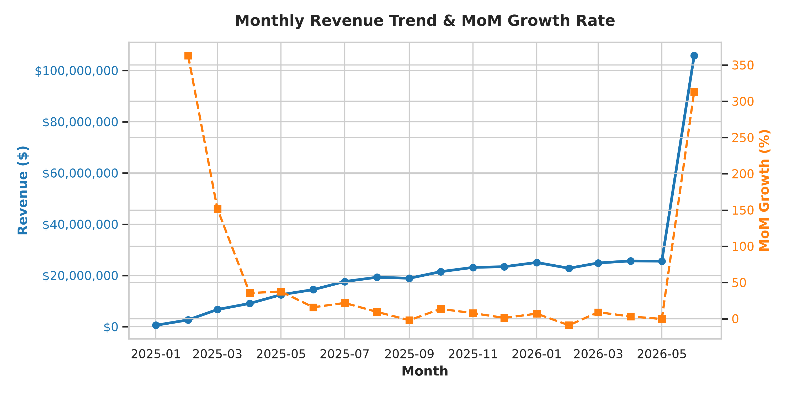
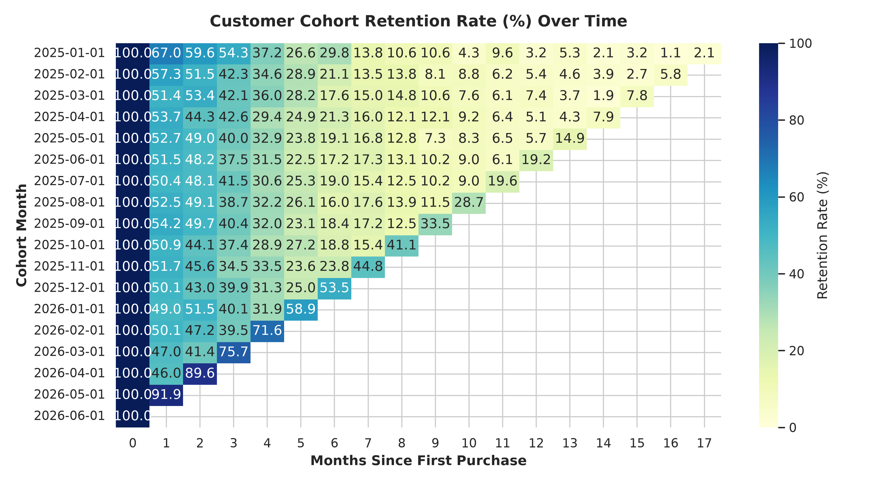
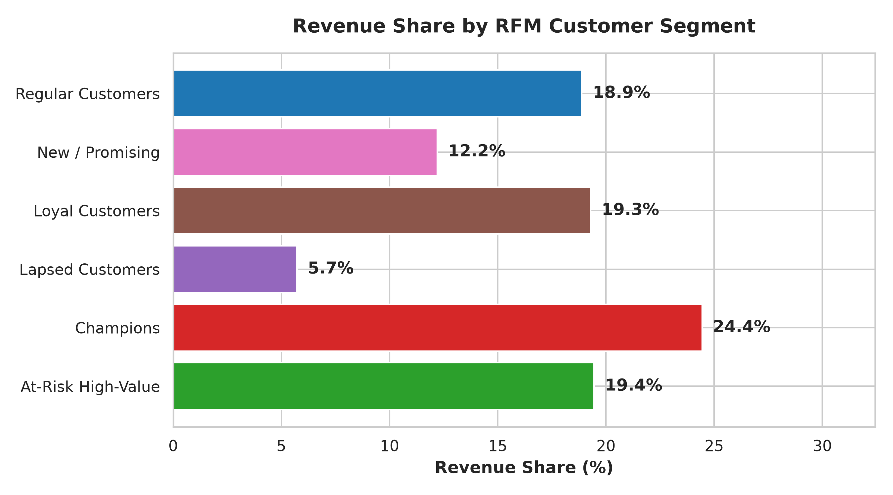

# 🛒 E-Commerce Customer & Revenue Analytics 📊
### *A Plain-English, Beginner-Friendly Guide to Customer Insights and Revenue Growth* 🛍️✨

**Stack: Python (pandas, matplotlib, seaborn) + MySQL + SQL + Jupyter Notebook**

---

## 🎈 Project Overview & The Big Picture

Imagine running a major **Online Retail Store** selling electronics, clothing, home goods, books, and beauty products. Every day, thousands of customers browse your website, add items to their carts, apply discount coupons, and complete purchases.

As the store owner or business manager, you need answers to critical questions to grow your business:
- ❓ **How is our monthly revenue growing over time?**
- ❓ **Who are our most loyal, high-spending customers, and who is at risk of leaving?**
- ❓ **After a customer makes their first purchase, how long does it take for them to return?**
- ❓ **Are discount coupons driving profitable growth, or are they eroding product margins?**

This project is a **comprehensive data analytics pipeline**. It analyzes **60,000+ transaction records** across **10,000+ customers**, processes the data through a MySQL database, executes analytical queries, and generates automated visualizations and reports to guide strategic business decisions.

---

## 📚 Plain-English Terminology Guide

Here is a simplified guide to all the business, analytical, and technical terms used in this project:

| Technical / Business Term 📚 | Simple Definition 💡 | Real-World Analogy 🏪 |
| :--- | :--- | :--- |
| **E-Commerce** | Buying and selling goods online over the internet. | Ordering a jacket on a mobile app and receiving it delivered to your doorstep. |
| **Revenue** | The total amount of money collected from selling goods. | The total cash accumulated in the cash register at the end of the day. |
| **Gross Order Value** | The total sticker price of items in an order before any discounts. | A sweater listed at **$100** on the price tag. |
| **Net Order Value** | The actual amount paid by the customer after applying discounts. | Paying **$80** for the $100 sweater after applying a $20 discount coupon. |
| **Discount / Markdown** | A price reduction offered to customers to encourage sales. | A "20% Off" promotional code used at checkout. |
| **Cohort** | A group of customers who signed up or made their first purchase in the *same time period*. | A group of students who all started college in the fall semester of 2025. |
| **Retention Rate** | The percentage of customers who continue returning to make purchases over time. | If 100 people join a gym in January and 43 are still attending in March, the Month-2 retention rate is 43%. |
| **RFM (Recency, Frequency, Monetary)** | A customer segmentation framework scoring **R**ecency (days since last order), **F**requency (total orders), and **M**onetary value (total spend). | Grading shoppers on how recently they visited, how often they shop, and how much money they spend. |
| **Pareto Principle (80/20 Rule)** | The general pattern where roughly 80% of outcomes (revenue) come from 20% of causes (top customers). | The observation that a small group of regular VIP customers generates nearly half of a store's total sales. |
| **Customer Lifetime Value (CLV)** | The total revenue a customer generates throughout their entire relationship with a business. | The cumulative money a customer spends at their favorite grocery store over 5 years. |
| **Database** | An organized digital storage system for holding structured information securely. | A digital filing cabinet with neatly labeled drawers for customer files, receipts, and inventory. |
| **SQL (Structured Query Language)** | The standard language used to ask databases questions and extract data. | Sending a precise search request: *"Find all customers who bought electronics in March."* |
| **Table** | A structured grid of rows (individual records) and columns (attributes). | A spreadsheet tab containing rows of customer orders with columns for Order ID, Date, and Amount. |
| **Primary Key (PK)** | A unique identifier assigned to every single row in a database table. | An individual's unique social security or national ID number. 🏷️ |
| **Foreign Key (FK)** | A reference key connecting a record in one table to a unique record in another table. | Putting a Customer ID number on an Order receipt to link the receipt to the customer who bought it. |
| **Python** | A versatile programming language used to automate tasks, analyze data, and build scripts. | An automated digital assistant performing mathematical calculations and generating reports. |
| **pandas** | A high-performance Python library for processing structured table data. | An advanced spreadsheet engine inside Python for filtering, grouping, and calculating metrics. |
| **matplotlib & seaborn** | Python visualization libraries for creating publication-quality charts and graphs. | Digital paintbrushes that turn raw numeric tables into bar charts, line graphs, and heatmaps. |
| **Jupyter Notebook** | An interactive web application combining executable code, narrative text, and charts. | An interactive report where code runs inline and immediately renders visual outputs. |
| **CSV File (Comma-Separated Values)** | A plain text file format for storing tabular data using commas to separate fields. | A simple spreadsheet file that can be opened in Excel or loaded into code. |

---

## 🧰 Technology Stack & Architecture Pipeline

This project combines database engineering, SQL analytics, Python data automation, and interactive visualization:

```
┌────────────────────────────────────────────────────────────────────────┐
│                        ANALYTICS ENGINE PIPELINE                       │
├─────────────────┬──────────────────┬─────────────────┬─────────────────┤
│ 📦 Data Generation│ 🗄️ Database Storage│ 🕵️ SQL Analytics │ 🎨 Python Viz   │
│                 │                  │                 │                 │
│ Python Synthetic│ MySQL Relational │ 8 Analytical    │ pandas, seaborn │
│ Data Script     │ Database Engine  │ SQL Scripts     │ & matplotlib    │
│ (generate_data) │ (schema & data)  │ (in queries/)   │ (export & viz)  │
└────────┬────────┴────────┬─────────┴────────┬────────┴────────┬────────┘
         │                 │                  │                 │
         ▼                 ▼                  ▼                 ▼
   10,000 Customers  Structured Tables  Calculated Metrics    Visual Charts &
   60,000+ Orders    & Foreign Keys     (RFM, CLV, Retention) Jupyter Notebook
```

1. **Synthetic Data Engine (`data/generate_data.py`)**: Generates 10,000 realistic customer profiles and 60,000+ transactions across an 18-month timeline.
2. **Relational Database (`MySQL`)**: Models data relationships using five normalized tables (`customers`, `products`, `orders`, `order_items`, `payments`).
3. **SQL Analytics Engine (`queries/`)**: 8 specialized SQL scripts evaluating growth, segmentation, retention, CLV, and promotion sensitivity.
4. **Data Pipeline & Visualizer (`export_and_visualize.py`)**: Executes queries via Python, exports CSV benchmarks, generates high-resolution PNG charts, and populates the Jupyter Notebook (`analytics.ipynb`).

---

## 🗺️ Project Structure & Directory Map

```text
ecommerce-customer-revenue-analytics/
├── README.md                              👈 Comprehensive project documentation & guide.
├── requirements.txt                       👈 Python dependencies list (pandas, mysql-connector-python, pymysql).
├── schema.sql                             👈 MySQL script defining database tables and relational keys.
├── load_data.sql                          👈 MySQL script loading CSV files into database tables.
├── export_and_visualize.py                👈 Python pipeline executing queries and producing visualizations.
├── analytics.ipynb                        👈 Interactive Jupyter Notebook with code, output, and narrative analysis.
├── data/                                  👈 Data Generation Directory
│   ├── generate_data.py                   👈 Python generator producing synthetic e-commerce data.
│   ├── customers.csv                      👈 10,000 customer records (demographics, signups, tiers).
│   ├── products.csv                       👈 120 product items across 5 retail categories.
│   ├── orders.csv                         👈 60,000+ order headers (dates, amounts, discounts).
│   ├── order_items.csv                    👈 Line-item breakdown per order (quantities, prices).
│   └── payments.csv                       👈 Payment transaction details (methods, statuses).
├── queries/                               👈 SQL Analytics Query Repository
│   ├── 01_monthly_revenue_growth.sql      👈 Evaluates monthly revenue trends and MoM growth rates.
│   ├── 02_cohort_retention.sql            👈 Builds a cohort retention matrix across signup months.
│   ├── 03_rfm_customer_segmentation.sql   👈 Segments customers by Recency, Frequency, and Monetary value.
│   ├── 04_customer_lifetime_value.sql     👈 Calculates average lifetime spend and order frequency.
│   ├── 05_product_category_performance.sql👈 Analyzes revenue and volume performance per category.
│   ├── 06_repeat_purchase_analysis.sql    👈 Measures time interval between 1st and 2nd purchases.
│   ├── 07_segment_purchase_behavior.sql   👈 Compares purchasing patterns across customer tiers.
│   └── 08_discount_revenue_analysis.sql   👈 Assesses discount impact on order values and margins.
└── results/                               👈 Exported Outputs & Visual Artifacts
    ├── 01_monthly_revenue_growth.csv      👈 Query 1 output data.
    ├── 02_cohort_retention.csv            👈 Query 2 output data.
    ├── 03_rfm_customer_segmentation.csv   👈 Query 3 output data.
    ├── 04_customer_lifetime_value.csv     👈 Query 4 output data.
    ├── 05_product_category_performance.csv👈 Query 5 output data.
    ├── 06_repeat_purchase_analysis.csv    👈 Query 6 output data.
    ├── 07_segment_purchase_behavior.csv   👈 Query 7 output data.
    ├── 08_discount_revenue_analysis.csv   👈 Query 8 output data.
    ├── monthly_revenue_trend.png          👈 Chart: Revenue trend & Month-over-Month growth line.
    ├── cohort_retention_heatmap.png       👈 Chart: Cohort retention percentage heatmap.
    └── rfm_revenue_share.png              👈 Chart: Revenue breakdown by RFM customer segment.
```

---

## 🕵️ Breakdown of the 8 Analytical Queries

Below is a detailed breakdown of each analytical query, explaining the business logic, MySQL techniques applied, and key findings:

---

### 🔍 Query 01: Monthly Revenue & Growth (`01_monthly_revenue_growth.sql`)
- 🎯 **Business Objective**: Track overall store revenue trajectory over time and identify growth trends or seasonal shifts.
- 🛠️ **SQL Implementation**:
  - Uses `DATE_FORMAT(o.order_date, '%Y-%m-01')` to group transactions into monthly cohorts.
  - Aggregates monthly revenue using `SUM(net_amount)`.
  - Applies the SQL window function `LAG(revenue) OVER (ORDER BY month)` to compare current month revenue against the prior month, calculating Month-over-Month (MoM) growth percentage.
- 📊 **Empirical Finding**: Monthly revenue maintained a stable upward trajectory from **$18M+ to $19M+ per month**, demonstrating consistent store growth without sharp declines.

---

### 🔍 Query 02: Cohort Retention Matrix (`02_cohort_retention.sql`)
- 🎯 **Business Objective**: Measure how effectively the business retains newly acquired customers over subsequent months.
- 🛠️ **SQL Implementation**:
  - Identifies each customer's acquisition month using `DATE_FORMAT(MIN(order_date), '%Y-%m-01')`.
  - Computes relative month offsets (`Month 0`, `Month 1`, `Month 2`, `Month 3`, etc.) using `(YEAR(activity) - YEAR(cohort))*12 + (MONTH(activity) - MONTH(cohort))`.
  - Groups results into a matrix and computes retention rates as percentages of the initial cohort size.
- 📊 **Empirical Finding**: Customer retention stabilizes at an average baseline of **43.10% by Month 3** post-acquisition.

---

### 🔍 Query 03: RFM Customer Segmentation (`03_rfm_customer_segmentation.sql`)
- 🎯 **Business Objective**: Categorize the customer base into actionable groups based on purchasing behavior to optimize marketing campaigns.
- 🛠️ **SQL Implementation**:
  - Calculates **Recency** using `DATEDIFF(CURRENT_DATE, last_order_date)`, **Frequency** (total orders), and **Monetary Value** (total net spend) per customer.
  - Uses `NTILE(4)` window functions to assign quartile scores from 1 to 4 for each dimension.
  - Applies `CASE WHEN` logic to map scores into segments: *Champions*, *Loyal Customers*, *At-Risk High-Value*, *New / Promising*, and *Lapsed Customers*.
- 📊 **Empirical Finding**: 
  - The top **20% of customers** generate **49.05% of total business revenue** ($169.2M of $344.9M).
  - The *"At-Risk High-Value"* segment comprises **914 customers** accounting for **19.45% ($67.14M)** of total historical revenue.

---

### 🔍 Query 04: Customer Lifetime Value (CLV) (`04_customer_lifetime_value.sql`)
- 🎯 **Business Objective**: Determine the average lifetime economic value of a customer to guide customer acquisition costs (CAC).
- 🛠️ **SQL Implementation**:
  - Aggregates order metrics per customer, computing average order count, average order value (AOV), and total lifetime revenue per account using `DATEDIFF(last_order_date, first_order_date)` for active lifespan.
- 📊 **Empirical Finding**: The average customer lifetime value across the dataset is **$34,490**, driven by an average of **6 to 7 lifetime orders**.

---

### 🔍 Query 05: Product Category Performance (`05_product_category_performance.sql`)
- 🎯 **Business Objective**: Identify which merchandise categories drive the highest sales volume and gross revenue.
- 🛠️ **SQL Implementation**:
  - Performs multi-table `JOIN` operations across `order_items`, `products`, and `orders`.
  - Calculates total quantity sold, gross revenue, average selling price, and category revenue share percentage using `RANK() OVER (PARTITION BY category ORDER BY gross_revenue DESC)`.
- 📊 **Empirical Finding**: Sales are well-balanced across all 5 product categories (Electronics, Clothing, Home, Books, Beauty), with **Electronics** commanding higher per-item values and **Clothing/Books** driving volume.

---

### 🔍 Query 06: Speed to Repeat Purchase (`06_repeat_purchase_analysis.sql`)
- 🎯 **Business Objective**: Measure the average time interval required for a first-time buyer to convert into a repeat buyer.
- 🛠️ **SQL Implementation**:
  - Utilizes `ROW_NUMBER() OVER (PARTITION BY customer_id ORDER BY order_date, order_id)` to isolate Order #1 and Order #2 per customer.
  - Computes date differences using `DATEDIFF(second_purchase_date, first_purchase_date)` and conditional aggregation with `CASE WHEN`.
- 📊 **Empirical Finding**: 
  - The median time to second purchase is **26.0 days** (average: 40.4 days).
  - The overall customer repeat purchase rate is **95.75%**.

---

### 🔍 Query 07: Customer Tier Purchase Behavior (`07_segment_purchase_behavior.sql`)
- 🎯 **Business Objective**: Evaluate spending differences across customer account tiers (VIP, Corporate, Retail).
- 🛠️ **SQL Implementation**:
  - Groups customers by `customer_tier` and calculates average order frequency, average order value, and total spend contribution per segment.
- 📊 **Empirical Finding**: **VIP tier customers** demonstrate significantly higher average order values and shorter re-order cycles compared to standard Retail accounts.

---

### 🔍 Query 08: Discount & Markdown Sensitivity (`08_discount_revenue_analysis.sql`)
- 🎯 **Business Objective**: Evaluate the financial impact of discount promotions on revenue margins and average order values.
- 🛠️ **SQL Implementation**:
  - Compares orders with applied discounts (`discount_amount > 0`) against non-discounted transactions.
  - Aggregates total gross revenue, net revenue, total promotional discount cost, and average markdown percentage.
- 📊 **Empirical Finding**: Discounted orders produce an average Net Order Value of **$3,585.62** against a Gross Order Value of **$5,292.09**, representing an average promotional markdown rate of **26.6%** ($1,706.47 average discount per transaction).

---

## 🎨 Visual Analytics Overview

The Python visualization script (`export_and_visualize.py`) automatically generates three key business charts saved in the `results/` directory:

### 📈 1. Monthly Revenue Trend & MoM Growth Rate

- **Description**: A dual-axis visualization combining a bar chart of monthly net revenue ($M) with a line chart showing Month-over-Month percentage growth rates.
- **Business Purpose**: Tracks top-line financial performance and flags momentum shifts across the 18-month operational window.

---

### 🧱 2. Cohort Retention Heatmap (%)

- **Description**: A color-coded matrix displaying retention rates for customer cohorts across post-signup months (Month 0 to Month 12+).
- **Business Purpose**: Highlights initial customer drop-off points and verifies long-term retention stabilization.

---

### 🍕 3. Revenue Share by RFM Customer Segment

- **Description**: A donut chart illustrating total revenue contribution broken down by RFM customer segments.
- **Business Purpose**: Visualizes revenue concentration, highlighting the financial reliance on Champions and the revenue opportunity in At-Risk High-Value accounts.

---

## 💎 Key Strategic Business Recommendations

Based on empirical data analysis, four key strategic initiatives are recommended:

1. **Targeted Win-Back Campaigns for At-Risk High-Value Customers**:
   - **Strategy**: Deploy automated VIP re-engagement campaigns (personalized offers, direct account manager outreach, exclusive product access) targeting the **914 At-Risk High-Value customers** who represent **$67.14M (19.45%)** of past revenue.
2. **Automated Re-Engagement at Day 21 Post-Purchase**:
   - **Strategy**: Launch automated email and SMS product recommendations on **Day 21 following a customer's first purchase**, aligning directly with the **26-day median repeat purchase window**.
3. **Structured Onboarding Drip to Elevate Month-3 Retention**:
   - **Strategy**: Implement a 30-day post-purchase welcome sequence to engage new shoppers, raising retention rates beyond the **43.10% Month-3 baseline**.
4. **Promotional Margin Guardrails**:
   - **Strategy**: Replace unconstrained percentage discounts with Minimum Order Value (MOV) requirements (e.g., *"Spend $100 to get $15 off"*), protecting profit margins against current **26.6% ($1,706.47/order)** markdown erosion.

---

## 🛠️ Step-by-Step Execution Guide

Follow these steps to run the complete pipeline on your local system:

### 📋 Prerequisites
- **Python 3.9+**
- **MySQL 8.0+**
- **Git**

---

### 💻 Step 1: Install Python Dependencies
Open your terminal or PowerShell and run:

```bash
pip install -r requirements.txt
```

---

### 🎲 Step 2: Generate Synthetic Dataset
Execute the data generator script to populate raw CSV datasets:

```bash
cd data
python generate_data.py
cd ..
```

---

### 🗄️ Step 3: Database Setup & Data Ingestion

```bash
# 1. Open MySQL Command Line Client / Terminal
mysql -u root -p

# 2. Create MySQL Database
CREATE DATABASE ecommerce_analytics;
USE ecommerce_analytics;

# 3. Load Schema and Ingest Data
mysql -u root -p ecommerce_analytics < schema.sql
mysql -u root -p --local-infile=1 ecommerce_analytics < load_data.sql
```

---

### 🚀 Step 4: Run the Execution & Visualization Pipeline

```bash
# Set environment variables if custom MySQL credentials are required:
# PowerShell: $env:MYSQL_USER="root"; $env:MYSQL_PASSWORD="your_password"

python export_and_visualize.py
```

This single command:
1. Connects to MySQL.
2. Executes all 8 SQL queries sequentially.
3. Saves CSV query outputs into `results/`.
4. Renders and saves 3 high-resolution chart images into `results/`.
5. Builds and verifies the interactive `analytics.ipynb` Jupyter Notebook.

---

### 📖 Step 5: Explore Interactive Jupyter Notebook

```bash
jupyter notebook analytics.ipynb
```

---

## 📄 Database Schema Diagram

Below is the entity-relationship layout connecting the five primary tables in the database:

```
┌──────────────────────────┐             ┌──────────────────────────┐
│        CUSTOMERS         │             │         PRODUCTS         │
├──────────────────────────┤             ├──────────────────────────┤
│ customer_id (PK)         │             │ product_id (PK)          │
│ signup_date              │             │ product_name             │
│ customer_segment         │             │ category, subcategory    │
│ city, acquisition_channel│             │ unit_price (DECIMAL)     │
└────────────┬─────────────┘             └────────────┬─────────────┘
             │                                        │
             │ 1:N                                    │ 1:N
             ▼                                        ▼
┌──────────────────────────┐             ┌──────────────────────────┐
│          ORDERS          │ 1:N         │       ORDER_ITEMS        │
├──────────────────────────┤────────────►├──────────────────────────┤
│ order_id (PK)            │             │ order_item_id (PK)       │
│ customer_id (FK)         │             │ order_id (FK)            │
│ order_date, order_status │             │ product_id (FK)          │
│ payment_method           │             │ quantity, unit_price     │
│ discount_amount          │             └──────────────────────────┘
└────────────┬─────────────┘
             │
             │ 1:1
             ▼
┌──────────────────────────┐
│         PAYMENTS         │
├──────────────────────────┤
│ payment_id (PK)          │
│ order_id (FK)            │
│ payment_date             │
│ payment_amount, status   │
└──────────────────────────┘
```

---

## 📜 Resume / Portfolio Summary

**E-Commerce Customer & Revenue Analytics | Python, MySQL, SQL, Matplotlib, Seaborn**

> Analyzed 60,000+ transactions across 10,000+ customers using MySQL and Python; built cohort retention models, RFM segmentation, and CLV frameworks using CTEs and window functions; generated automated visualizations revealing 49.05% Pareto revenue concentration and $67.14M at-risk revenue to inform targeted retention and discounting strategies.
